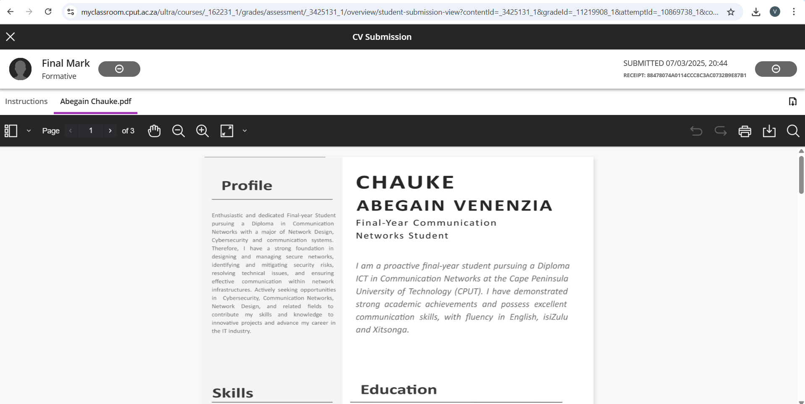
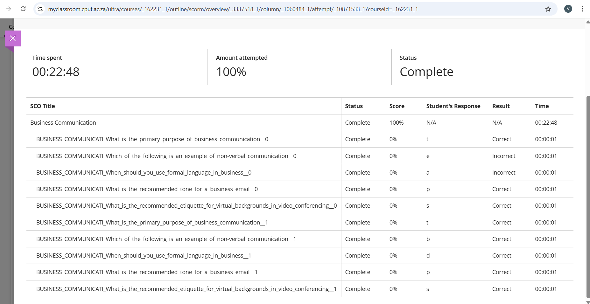
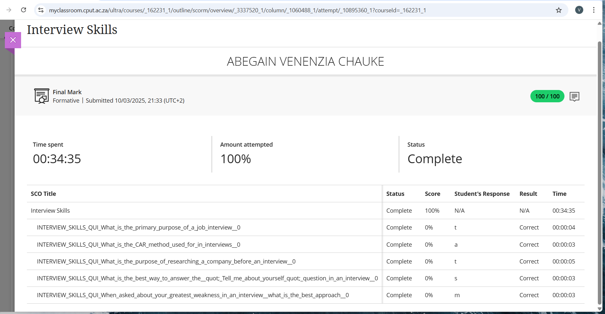

# PORTFOLIO
**Name:** Abegain Venezia Chauke  
**Qualification:** ICT in Communication Networks                                                                                                                                                                                      
**Student Number:** 230069509

## 👤 About Me
I am Abegain Venezia Chauke, a final-year student pursuing a Diploma in Communication Networks at the Cape Peninsula University of Technology. I am passionate about designing, securing, and managing network systems that support modern communication technologies.

I have gained practical and theoretical knowledge in network security, IP addressing, network configurations, and Linux operating systems, along with experience using tools like Cisco Packet Tracer. I am fluent in English, isiZulu, and Xitsonga, and I enjoy working in both collaborative and independent environments.

As someone who is goal-driven and detail-oriented, I am now looking to apply my skills in areas such as cybersecurity, communication infrastructure, and network design, and contribute meaningfully to innovative IT projects.

## 1. Career Counselling
###  Evidence
I attended the Career Counselling Session in 2025 focused on ICT career paths. It provided insight into roles like Network Analyst, Security Specialist, and Infrastructure Support. We were ask to come up with a problem that we also need to provide a solution ourselves for it as a group.

[PROJECT](project3.pdf)

###  Reflection (STAR)
- **S:** I wasn’t sure which ICT career to pursue.  
- **T:** I needed to understand my options in networking and cybersecurity.  
- **A:** I attended a faculty-led career counselling workshop.  
- **R:** I gained direction and chose to focus on cybersecurity and communication networks.

  ##  2. Skills and Interests
  ###  Evidence
  Based on self-assessment and coursework, my top skills are:
- IP Addressing and Network Configurations  
- Network Security  
- Communication Skills  
- Linux OS  
- Packet Tracer and Network Design  
- SQL Programming

  ###  Reflection (STAR)
- **S:** I wanted to align my skills with industry demands.  
- **T:** I reviewed my coursework and completed LinkedIn Learning on SQL and UX Design.  
- **A:** I noted key strengths in hands-on network setups and problem-solving.  
- **R:** I confirmed my interest and talent in network configuration and cybersecurity.

  
##  3. Personality Assessment
###  Evidence
I was given a trust that I should update a GRADSTAR APP Version and I completed it in two days, in my team I was the first persion to complete the task. There is a task also that I was given in class, I wrote and i got a total. While I was doing all these task I found out a lot about myself and what I am capable of.
[TASK](Assessment.pdf)

###  Reflection (STAR)
- **S:** I was unsure about how I work in team and solo settings.  
- **T:** I took the MBTI test to understand myself better.  
- **A:** I completed the 16Personalities quiz online.  
- **R:** I realized I enjoy structured tasks and excel in roles with clear goals and processes.

  ##  4. Create a CV
  ###  Evidence
[📎 View My CV (PDF)](CV.pdf)

Includes:
- Education (2023–2025, CPUT – Communication Networks)  
- Skills in Networking, Cybersecurity, and Programming  
- Certifications (LinkedIn SQL, UX Design)  
- Languages: English, isiZulu, Xitsonga

###  Reflection (STAR)
- **S:** My old CV lacked technical detail.  
- **T:** I needed to update it for job readiness.  
- **A:** I created a professional, structured CV using my portfolio and training.  
- **R:** My updated CV better highlights my strengths and academic background.

##  5. CV Submission
###  Evidence
CV was submitted for feedback in March 2025.

###  Reflection (STAR)
- **S:** I wanted expert feedback to improve my CV.  
- **T:** I submitted it during the final-year workshop.  
- **A:** I applied suggestions and improved formatting and structure.  
- **R:** I now have a job-ready CV that has already helped me apply for internships

##  6. Business Communication
###  Evidence
I completed the Business Communication module with a full completion status, scoring 100%. The course covered key topics such as non-verbal communication, formal language, and professional email tone.

###  Reflection (STAR)
- **S:** I needed to strengthen my communication skills for professional and academic environments.
- **T:** The goal was to complete the Business Communication online module and demonstrate understanding of effective workplace communication.
- **A:** I studied each topic, focusing on email etiquette, tone, and verbal and non-verbal communication principles. 
- **R:** I successfully completed the module with 100% completion, improving my ability to write and communicate clearly in a professional setting.

##  7. Interview Skills
###  Evidence
I managed to complete the Interview Skills module with 100% completion and a perfect score. The course covered topics like the CAR method, company research, and answering interview questions effectively.

###  Reflection (STAR)
- **S:** I wanted to build confidence and improve my performance in job interviews.
- **T:** I had to complete the Interview Skills module to learn structured methods for responding to interview questions.
- **A:** I practiced the CAR (Context, Action, Result) technique and learned how to present my strengths and weaknesses professionally.
- **R:** I achieved 100% in the module, gained valuable interview preparation skills, and learned how to communicate my experiences effectively during interviews.

##  8. Mock Interview Video
###  Evidence
We were required to do a Mock Interview video to show the skill out of what we have learned on the Interview Skills Module. I made a video answering the questions that I picked to answer under seven types of interview question.

